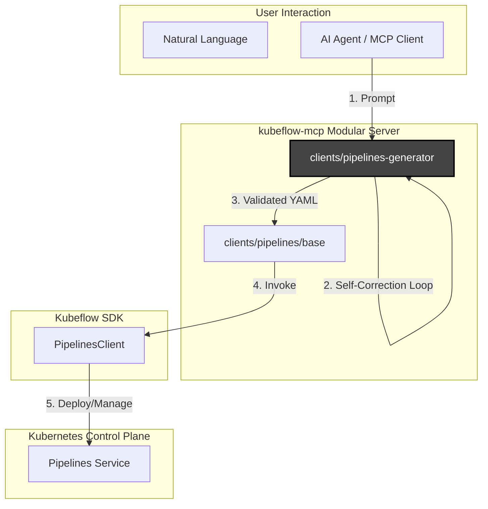

title: "Kubeflow PieplinesClient support for `kubeflow-mcp-server`"

authors:
  - "@droctothorpe"
  - "@modichika"

status: proposed

creation-date: 2026-15-07


# KEP: Kubeflow PieplinesClient support for `kubeflow-mcp-server`

## 1. Summary
This KEP proposes the implementation of an agentic `kfp-generator` skill within the `kubeflow-mcp-server`. This tool allows AI agents to translate natural language user prompts into functional Kubeflow Pipeline (KFP) v2 Python code.
It adds a kubeflow pipelines skills where an agent takes a prompt from a user(developer, data scientist, etc..), writes the Python code, tests the compilation, catches any errors, and feeds them back into itself until it successfully generates a valid pipeline file.
it introduces an agentic skill, that will help users to get a verified, evaluated pipeline(YAML files) with natural language.

## 2. Motivation

Writing kubeflow pipelines python file or YAML file is notoriously difficult, and data scientists often miss the syntax needed to write the pipeline files like YAML.
An agentic AI skill that will automate this process, will come in handy and useful removing the friction of writing bolierplate codes.

### Problem Statement

Syntax errors and boilerplate requirements result in iterative frustration. By introducing an agentic skill that automates this process, we enable users to describe their pipeline in natural language and receive a verified, compile-ready pipeline artifact, removing the barrier to entry for KFP workflow automation.


### Architecture Context

* Built the Self-Correction Loop: Set up the feedback mechanism (Prompt → Code → Catch Error → Fix) so it runs non-interactively without needing human input.
* Added Demo Prompts: Tested the agent against the specific scenarios we wanted for a solid demo, including the Iris classifier and MNIST datasets, churn_prediction, image_anamoly_detection, time_series_forecasting.

```

`User Prompt` → `Agent` → `kfp-generator` → `pipeline.py` → `Compiler (Verification)` → `Verified YAML Specification`

```

**Proof of completed runs(POV):**

* Iris Classification Pipeline Execution 


* MNIST Training Pipeline Verification 


* Customer Churn Prediction (XGBoost Workflow) 


* Image Anomaly Detection (Isolation Forest Workflow) 


*  Time-Series forecasting


### Goals
* **Agentic Interface**: Expose pipeline generation as an MCP tool skill (`kfp-generator`) to empower orchestrator agents, with natural language our users can get a well-tested compiled .YAML file.

* **Self-Correction Loop**: Implement an automated feedback mechanism (`Prompt` -> `Code` -> `Compile` -> `Catch Error` -> `Fix`) to eliminate the need for human intervention initially.

* **Validation Standards**: 100% compatibility with KFP v2 SDK IR (Intermediate Representation) by enforcing local compilation and validation checks.

* **Integration**: Integrate with existing `kubeflow-mcp-server` infrastructure (personas, namespace enforcement, etc.).

### Non-Goals
* Replacing the standard Kubeflow UI or official KFP SDK documentation. It wraps the kfp-sdk compiler not replace it.

* Support for legacy KFP v1 pipelines (focused exclusively on KFP v2).

* Automatic handling of complex secrets/credentials beyond standard namespace integration.

* Need of always updating the compiler as new things comes up so that our agentic AI knows what and which version to compile for.

## 3. Proposal
This Agentic-AI skills is wrapped around the kfp-sdk compiler kfp-esque way!

### Architecture Overview:


### Request Flow:

```

* User -> AI Agent: Natural language request
* AI Agent -> MCP Server: JSON-RPC tool call
* MCP Server -> Kubeflow SDK: Python method call
* Kubeflow SDK -> K8s API: CRD operations

```
## 4 .Design Details

### Component Architecture
The `kfp-generator` acts as a specialized skill registered within the `kubeflow-mcp-server`. The process follows a three-stage workflow:

* **Generation Phase**: The agent receives a natural language prompt and utilizes an LLM to generate the `pipeline.py` script, including necessary imports and component decorators.

*  **Verification Phase**: The agent invokes the local evaluation script (`eval_output.py`) within a protected, isolated virtual environment to attempt compilation.

*  **Correction Phase**: If the compilation fails, the agent parses the stderr/stdout logs, feeds the error details back into the prompt context, and iterates until the `VALIDATION PASSED` status is achieved.

### Workflow Visualization
```

`User Prompt` → `Agent` → `kfp-generator` → `Raw Code` → `Compiler (Verification)` → `Verified YAML Specification`

```

### Module Structure:
```

clients/pipelines/
├── __init__.py
├── base.py
├── skills/                      # Centralized directory for agentic capabilities
│   ├── kfp_generator/           # Specific skill for pipeline generation
│   │   ├── SKILL.md
│   │   ├── generator.py         # Code scaffolding logic
│   │   ├── validator.py         # Self-correction / verification logic
│   │   └── templates/           # Reusable pipeline patterns
│   └── kfp_debugger/            # Future agentic skills can be added here
├── scripts/
│   └── eval_output.py           # Verification script used by the validator
└── examples/                    # Testing scenarios

```
### Verified Tests:

* Included example tests -> inputs and outputs, e.g. prompts and the pipelines they generate.

* https://github.com/modichika/pipelines/tree/kfp-skills-testing/skills/kfp-generator/examples 

* Tested the agent against the specific scenarios we wanted for a solid demo, including the Iris classifier and MNIST datasets, churn_prediction, image_anamoly_detection, time_series_forecasting.

### UNIT-TEST
* name_of_the_demo (churn_prediction, Iris classifications, MNIST datasets, image_anamoly_detection, time_series_forecasting):
    ```
                       1. pipeline.py --> llm generated python pipeline file which will go under the evaluation script to generate correct .yaml file

                       2. pipeline.py.yaml --> the successful .yaml file.

                       3. prompt.md --> a .md file that contains the natural language users can provide.
                       
                       4. successful_ss.png --> an image containing the verfication log's screenshot.
    
    ```
    
    

### Skill Governance

To confirm the `kfp-generator` is discoverable and maintainable, a `SKILL.md` file will be included within the `skills/kfp-generator/` directory. This file acts as the agent's "interface" detailing the skill's purpose, natural language triggers, and operational constraints for autonomous invocation.


## 5. Risks and Mitigations
* **Risk: LLM Hallucinations**: Generated code may be syntactically valid but logically incorrect.
    * *Mitigation*: The current "compile-and-verify" loop mitigates syntax errors; future iterations will include logic-level unit tests for generated components.
* **Risk: Resource Consumption**: Recursive correction loops could lead to excessive local compute usage.
    * *Mitigation*: Implement configurable loop limits (e.g., max 3 attempts) and caching of successful pipeline patterns.


## 6. Future Implementations:
```

If a user asks for a "standard churn prediction pipeline" or others similar jobs, the generator should look for existing successful YAML/Python patterns in your examples/ folder rather than starting from scratch every time. This will reduce latency and compute costs.

```


## 6. References
* [Katib (Optimizer) KEP/PR Reference](https://github.com/kubeflow/mcp-server/pull/48)

* [KFP-Generator Implementation](https://github.com/modichika/pipelines/tree/kfp-skills-testing/skills/kfp-generator)

* [Agentic AI Skills Issue on Kubeflow Pipelines](https://github.com/kubeflow/pipelines/issues/13423)
